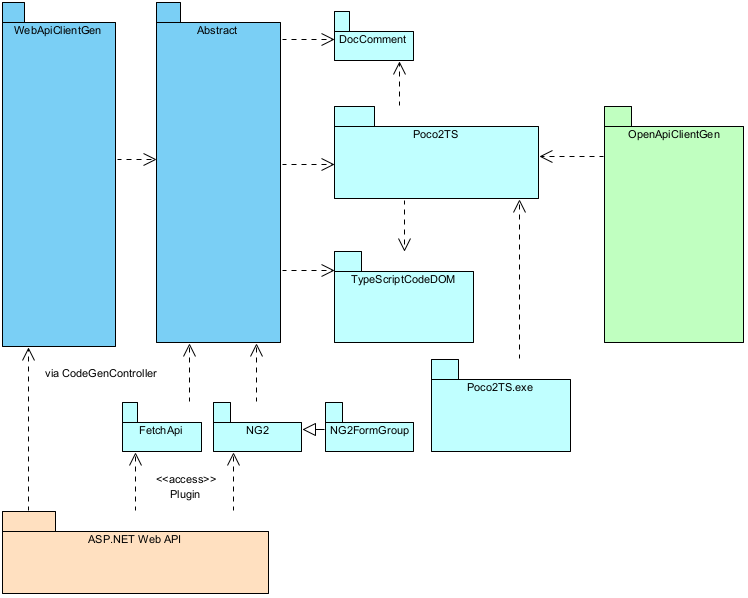

Strongly Typed Client Web API Generators (WebApiClientGen) generate client API code in C# and TypeScript from ASP.NET (Core) Web API.

WebApiClientGen does not rely on Swagger/OpenAPI definitions. Instead, it walks through the runtime type information of a running Web API in a debug build, avoiding the inherent limitations of OpenAPI when analyzing .NET types and Web API behaviors, ultimately delivering a better developer experience for ASP.NET (Core) Web API developers, .NET client developer and TypeScript client developers.

## Downloads and Use Cases

The component set is released mostly through NuGet.
1. [Fonlow.WebApiClientGenCore ](https://www.nuget.org/packages/Fonlow.WebApiClientGenCore/) for generating C# client API. And to generate TypeScript client APIs, add the following plugins:
	1. [Fetch API ](https://www.nuget.org/packages/Fonlow.WebApiClientGenCore.Fetch/)
	1. [Angular 6+ ](https://www.nuget.org/packages/Fonlow.WebApiClientGenCore.NG2/)
	1. [Angular 6+ with Reactive Forms ](https://www.nuget.org/packages/Fonlow.WebApiClientGenCore.NG2FormGroup/) as [explained](https://github.com/zijianhuang/webapiclientgen/wiki/Angular-Reactive-Forms)
	1. [AXIOS ](https://www.nuget.org/packages/Fonlow.WebApiClientGenCore.Axios/)
	1. [Aurelia ](https://www.nuget.org/packages/Fonlow.WebApiClientGenCore.Aurelia/)
	1. [jQuery ](https://www.nuget.org/packages/Fonlow.WebApiClientGenCore.jQuery/) and [HttpClient helper library](https://github.com/zijianhuang/webapiclientgen/blob/master/DemoCoreWeb/TsScripts/src/ClientApi/HttpClient.ts)

1. [Fonlow.TypeScriptCodeDOMCore ](https://www.nuget.org/packages/Fonlow.TypeScriptCodeDOMCore) for developing TypeScript code generator through the CodeDOM approach.
1. [Fonlow.Poco2TSCore ](https://www.nuget.org/packages/Fonlow.Poco2TsCore) for developing TypeScript code generator through the CodeDOM approach for POCO and more.
1. [Poco2TSCore.exe, a console app](https://github.com/zijianhuang/webapiclientgen/tree/master/Poco2TsCore) for generating TypeScript type interfaces from POCO.
1. [Fonlow.DocCommentCore ](https://www.nuget.org/packages/Fonlow.DocCommentCore) for reading XML document of an .NET assembly
1. [Fonlow.DataOnlyExtensions](https://www.codeproject.com/Articles/5325820/DateOnly-in-NET-6-and-ASP-NET-Core-6) with JSON converters for handling date only scenarios between the clients and server which sit in different timezones. [3 NuGet packages ](https://www.nuget.org/packages?q=fonlow.dateonlyextensions) are available including one for .NET Framework.

### Setup for Fonlow.WebApiClientGenCore

1. Add [CodeGenController.cs](https://github.com/zijianhuang/webapiclientgen/blob/master/DemoCoreWebControllers/Controllers/CodeGenController.cs) to folder "Controllers"
2. Ensure ApiExplorer visible through having the following in `program.cs`:
```
builder.Services.AddControllers(configure =>
{
#if DEBUG
	configure.Conventions.Add(new Fonlow.CodeDom.Web.ApiExplorerVisibilityEnabledConvention());//To make ApiExplorer be visible to WebApiClientGen
#endif
})
```
3. Define the [settings of the CodeGen](https://github.com/zijianhuang/webapiclientgen/blob/master/DemoCoreWeb/CodeGen.json).

### Generate Client API Codes from Web API

1. Launch the debug build of Web API
2. Post the settings of the CodeGen to Web API.

Alternatively, you can use PowerShell scripts to automate. Please refer to these 2 examples:
1. [CreateDemoCoreWebClientApi.ps1](https://github.com/zijianhuang/webapiclientgen/blob/master/CreateDemoCoreWebClientApi.ps1)
1. [CreateDemoTextJsonWebClientApi.ps1](https://github.com/zijianhuang/webapiclientgen/blob/master/CreateDemoTextJsonWebClientApi.ps1)

### Package Diagram of Downloads



**Hints:**

* [OpenApiClientGen](https://github.com/zijianhuang/openapiclientgen) based on key components of WebApiClientGen is a spin-off for generating client API codes in C# and TypeScript according to a definition file of Swagger/Open API Specification. Therefore the codes generated look fairly similar to what generated by WebApiClientGen.

**Remarks:**

* The development had started in year 2015 supporting .NET Framework, then .NET Core 2. And Tag "[LastCore31](https://github.com/zijianhuang/webapiclientgen/tree/LastCore31)" is to mark the last snapshot supporting .NET Framework 4.6.2 and .NET Core 3.1.
* Starting from 2021-02-10, the development will support only .NET 5 and onward.
* Wiki contents about .NET Framework will be kept in foreseeable future.

## Key Features
1. Client API codes generated are directly mapped from the runtime type information of the Web API controller methods, .NET primitive types and POCO classes.
1. Doc comments of controller methods and POCO classes are copied. 
1. Some validation attributes are copied to C# client API codes.
1. Some validation attributes are used to generate doc comments for TypeScript codes.
1. Some validation attributes are transformed into validators of Angular Reactive Forms.
1. .NET generic types are supported.
 
## Key Benefits for Developer Experience

1. WebApiClientGen is seamlessly integrated with ASP.NET Core Web API with very little steps/overheads to setup, maintain and synchronize between Web API and client APIs, during RAD or Agile Software Development.
1. Support all .NET primitive types including decimal.
1. Support DataTime, DataTimeOffset, DateOnly, Array, Tuple, Dynamic Object, Dictionary and KeyValuePair
1. Strongly typed generated codes are subject to design time type checking and compile time type checking.
1. Provide high level of abstraction, shielding application developers from repetitive technical details of RESTful practices and traditional codes of AJAX calls.  
1. Rich meta info including doc comments make IDE intellisense more helpful, so application developers have less need of reading separated API documents.
1. Generated doc comments based on .NET validation attributes.
1. Generated doc comments based on numeric types, DateOnly and GUID for TypeScript codes.
1. Generated TypeScript codes conform to the [TypeScript strict mode](https://www.typescriptlang.org/tsconfig#strict), and the generated Angular 2+ codes conform to the [Angular strict mode](https://angular.io/guide/strict-mode).


# Examples

1. [POCO classes](https://github.com/zijianhuang/webapiclientgen/blob/master/DemoWebApi.DemoDataCore/Entities.cs)
1. [Web API](https://github.com/zijianhuang/webapiclientgen/blob/master/DemoCoreWebControllers/Controllers/EntitiesController.cs)
1. [Generated client API C# codes](https://github.com/zijianhuang/webapiclientgen/blob/master/DemoCoreWeb.ClientApi/WebApiClientAuto.cs)
1. [Client codes using the generated library in C#](https://github.com/zijianhuang/webapiclientgen/blob/master/Tests/IntegrationTestShared/EntitiesApiIntegration.cs)
1. Generated client data models and API in TypeScript [for Angular 2](https://github.com/zijianhuang/webapiclientgen/blob/master/HeroesDemo/src/clientapi/WebApiCoreNg2ClientAuto.ts), [for Fetch](https://github.com/zijianhuang/webapiclientgen/blob/master/fetchapi/src/clientapi/WebApiCoreFetchClientAuto.ts), [for Aurelia](https://github.com/zijianhuang/webapiclientgen/blob/master/aurelia/src/clientapi/WebApiCoreAureliaClientAuto.ts) and [for Axios](https://github.com/zijianhuang/webapiclientgen/blob/master/axios/src/clientapi/WebApiCoreAxiosClientAuto.ts)
1. [Client codes using the generated library in TypeScript](https://github.com/zijianhuang/webapiclientgen/blob/master/HeroesDemo/src/clientapi/WebApiNG2ClientAuto.spec.ts)
1. [Online Demo with Angular Heroes](https://zijianhuang.github.io/webapiclientgen) hosted in GitHub.IO talking to a real backend

**Remarks:**
1. JavaScript codes compiled from generated TypeScript codes could be used in JS applications, however, obviously no type info will be available, while application programmers may still enjoy intellisense and abstraction from AJAX details.
	1. React and Vue.js applications typically use Axios or Fetch API for HTTP requests. Since June 2019, [babel](https://github.com/babel/babel) has supported namespaces thanks to [this pull request](https://github.com/babel/babel/pull/9785), so you should be able to do React TSX programming with generated TypeScript codes.


# Concepts
1. Web API vendors / developers should provide client API libraries to developers of client programs, as Google and Amazon etc. would do in order to make the RESTful or RPC Web API reach wider consumers (internal and external) efficiently.
1. To client developers, classic function prototypes like `ReturnType DoSomething(Type1 t1, Type2 t2 ...) ` is the API function, and the rest is the technical implementation details of transportation: TCP/IP, HTTP, SOAP, resource-oriented, CRUD-based URIs, RESTful, XML and JSON etc. The function prototype and a piece of API document should be good enough for calling the API function.
1. The better you have separation of concerns in your Web API design, the more you will benefit from the components of this project in order to deliver business values sooner, with less handcrafted codes , less repetitive tasks and less chances of human mistakes.

## Expected Programming Practices

### Strongly Typed Function Prototype

```ReturnType DoSomething(Type1 t1, Type2 t2 ...)```

```c#
		[HttpGet]
		[Route("getPerson/{id}")]
		public Person GetPerson(long id)
```

### Model Validation through Middleware

Rather than writing explicit codes of validating the request payload, it is expected that you use middleware to validate. For example:

```c#
public void ConfigureServices(IServiceCollection services)
{
	services.AddControllers(
		options =>
		{
			options.Filters.Add(new ValidateModelAttribute()); // wholesale style to check model binding for all API calls.

```


References:

* [Model Validation in ASP.NET Web API](https://learn.microsoft.com/en-us/aspnet/web-api/overview/formats-and-model-binding/model-validation-in-aspnet-web-api#handling-validation-errors)
* [Model Validation in ASP.NET Core MVC and Razor Pages](https://learn.microsoft.com/en-us/aspnet/core/mvc/models/validation)

### Model Validation through [ApiControllerAttribute](https://learn.microsoft.com/en-us/aspnet/core/web-api/#apicontroller-attribute)

For example:
```c#
	[ApiController]
	[Route("api/[controller]")]
	public class HeroesController : ControllerBase
	{
```

### Non-2xx HTTP Status Codes Handled by Middleware, optional

Even if you explicitly write codes in an API function to handle exceptions and return non-2xx HTTP status code, you should have a safty net of catching uncaught exceptions and return HTTP status codes.

References:

* [ASP.NET Core Middleware](https://learn.microsoft.com/en-us/aspnet/core/fundamentals/middleware)

## More Documentations
1. [WIKI](https://github.com/zijianhuang/webapiclientgen/wiki)
1. [Settings Explained](SettingsExplained.md)
1. [Generate C# .NET Client API for ASP.NET Web API](https://www.codeproject.com/Articles/1074039/Generate-Csharp-Client-API-for-ASP-NET-Web-API) / [Local Copy](Doc/Articles/Generate%20C#%20Client%20API%20for%20ASP.NET%20Web%20API%20-%20CodeProject.html)
1. [Generate TypeScript Client API for ASP.NET Web API](https://www.codeproject.com/articles/1053601/generate-typescript-client-api-for-asp-net-web-api) / [Local Copy](Doc/Articles/Generate%20TypeScript%20Client%20API%20for%20ASP.NET%20Web%20API-%20CodeProject.html)
1. [ASP.NET Web API, Angular2, TypeScript and WebApiClientGen](https://www.codeproject.com/Articles/1165571/ASP-NET-Web-API-Angular-TypeScript-and-WebApiClie) / [Local Copy](Doc/Articles/ASP.NET%20Web%20API,%20Angular2,%20TypeScript%20and%20WebApiClientGen%20-%20CodeProject.html)
1. [Generate C# Client API for ASP.NET Core Web API](https://www.codeproject.com/Articles/1243908/Generate-Csharp-Client-API-for-ASP-NET-Core-Web-AP) / [Local Copy](Doc/Articles/Generate%20C#%20Client%20API%20for%20ASP.NET%20Core%20Web%20API%20-%20CodeProject.html)
1. [Intended Solutions for Intentional Limitations of Strongly Typed OpenAPI Client Generators](https://www.codeproject.com/Articles/5376030/Intended-Solutions-for-Intentional-Limitations-of) / [Local Copy](Doc/Articles/Intended%20Solutions%20for%20Intentional%20Limitations%20of%20Strongly%20Typed%20OpenAPI%20Client%20Generators%20-%20CodeProject.html). The article is just using OpenApiClientGen as an example, while the principles and solutions can be applied to generated codes by WebApiClientGen for your client apps.
1. [DateOnly in ASP.NET Core 6](https://www.codeproject.com/Articles/5325820/DateOnly-in-NET-6-and-ASP-NET-Core-6) / [Local Copy](Doc/Articles/DateOnly%20in%20.NET%206%20and%20ASP.NET%20Core%206%20-%20CodeProject.html)

## Demo Applications

The Demo applications in this repository are mainly for testing WebApiClientGen during development. And there are other demo applications in the following repositories, demostrating how real world applications could utilize WebApiClientGen:

1. [.NET Core Demo](https://github.com/zijianhuang/DemoCoreWeb) for ASP.NET Core MVC, Web API, ASP.NET Core + Angular, MAUI, fetchAPI, vue TS and React TS. 
1. [WebApiClientGen Examples](https://github.com/zijianhuang/webapiclientgenexamples) for .NET Framework, .NET Standard, Xamarin, and vue TS.
1. [WebApiClientGen vs Swagger](https://github.com/zijianhuang/DemoCoreWeb/tree/SwaggerDemo)

These demo applications are actively maintained and kept up-to-date with the latest frameworks. If you are still staying with some older frameworks like Angular 4 or 5 or .NET Core 2.0, you may navigate to respective tags of the repositories and checkout.

### Tour of Heroes

[Tour of Heroes](https://angular.io/tutorial/tour-of-heroes) is the official Angular tutorial demo app.

To illustrate the programmer experience of using WebApiClientGen, the following demo apps are crafted with similar architectural design for the same functional features on various development frameworks or libraries, however, talking to a real backend.

1. [Angular 2+](https://github.com/zijianhuang/webapiclientgen/tree/master/HeroesDemo), and article: [Generate Typed FormGroup of Angular Reactive Forms with ASP.NET Core Web API](https://www.codeproject.com/Articles/5374226/Generate-Typed-FormGroup-of-Angular-Reactive-Forms) / [Local Copy](Doc/Articles/Generate%20Typed%20FormGroup%20of%20Angular%20Reactive%20Forms%20with%20ASP.NET%20Core%20Web%20API%20-%20CodeProject.html)
1. [Xamarin](https://github.com/zijianhuang/webapiclientgenexamples/tree/master/Mobile)
1. [MAUI](https://github.com/zijianhuang/DemoCoreWeb/tree/master/mobile). Migrated from Xamarin Heroes.
1. [Aurelia](https://github.com/zijianhuang/DemoCoreWeb/tree/master/AureliaHeroes). Integration test suite included.
1. [React](https://github.com/zijianhuang/DemoCoreWeb/tree/master/ReactHeroes).  Integration test suite included.
1. Article: [Tour of Heroes: Blazor WebAssembly Standalone App](https://www.codeproject.com/Articles/5383736/Tour-of-Heroes-Blazor-WebAssembly-Standalone-App) / [Local Copy](Doc/Articles/Tour%20of%20Heroes_%20Blazor%20WebAssembly%20Standalone%20App%20-%20CodeProject.html)

## NewtonSoft.Json or System.Text.Json

While WebApiClientGen supports both, however, the primary support has shifted to System.Text.Json since 2024.

NewtonSoft.Json still has a few advantages upon certain scenarios and contexts:
1. If you have a lot POCO classes decorated by DataContractAttributes, because of supporting legacy apps, or supporting both XML and JSON serialization, NewtonSoft.Json gives you inherent support, while System.Text.Json provides some troublesome and indirect support since .NET 7.
2. For some array types and dynamic, NewtonSoft.Json is still better.

# Contributing

[CONTRIBUTING.md](CONTRIBUTING.md)