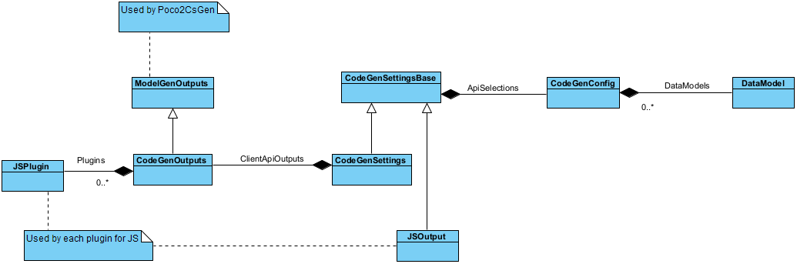
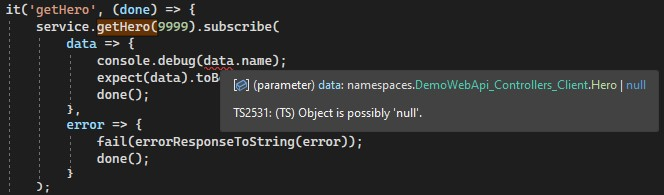

# Settings

WebApiClientGen generates client API according to POCO classes/interfaces and API functions grouped by "ControllerBase" declared in assemblies and runtime type info.

And WebApiClientGen receives settings through an API call "api/codegen" with a POST payload of JSON data.

The schema and the semantic meanings of the JSON data are described in "[CodeGenParameters](https://github.com/zijianhuang/webapiclientgen/blob/master/WebApiClientGenCore.Abstract/CodeGenParameters.cs)". And the followig sections give further explaination.



## ApiSelection

### ExcludedControllerNames
```c#
/// <summary>
/// To exclude some controllers. For example, [My.Namespace.Home, My.Namespace.FileUpload] for My.Namespace.HomeController and My.Namespace.FileUploadController.
/// </summary>
public string[] ExcludedControllerNames { get; set; }
```

WebApiClientGen is focused on strongly typed Web API, while some Web APIs are not strongly typed. Thus this setting excludes them, otherwise, the generated codes of some client APIs are not usable. For such APIs, it is better to hand craft client codes according to their dynamic behaviors.

**Hints**

* Decorating respective controllers with `[ApiExplorerSettings(IgnoreApi = true)]` instead may be more practical, since [ApiExplorerSettingsAttribute](https://learn.microsoft.com/en-us/dotnet/api/microsoft.aspnetcore.mvc.apiexplorersettingsattribute) was firstly introduced in .NET Framework 4.5.1, while the early releases of WebApiClientGen were built for .NET Framework 4.5. Therefore, "ExcludedControllerNames" may be considered as obsolete.
* [ApiExplorerSettingsAttribute](https://learn.microsoft.com/en-us/dotnet/api/microsoft.aspnetcore.mvc.apiexplorersettingsattribute) can decorate a controller class or a controller function. If you intend to mix strongly typed API functions and weakly typed ones in the same controller, you may use the attribute to decoreate at the method level.

Typically, a strongly typed API function is associated with such content type in payloads of request and response:
1. "application/json" for JSON object.
1. "application/xml" for XML DOM object.
1. "text/plain" for plain text.

For business applications, often it is technically and semantically more practically to group strong typed calls and weakly typed calls into different controllers. 

If an API function deals with form data, HTML or stream, the function is weakly typed, for examples:

* The accept content type with "application/x-www-form-urlencoded" or "text/html" etc. Typically the function is decorated with [ConsumesAttribute](https://learn.microsoft.com/en-us/dotnet/api/microsoft.aspnetcore.mvc.consumesattribute).

```c#
[AllowAnonymous]
[Consumes("application/x-www-form-urlencoded")]
[HttpPost]
public async Task<ActionResult<TokenResponseModel>> Authenticate([FromForm] UsernameModel model,
...

[HttpPost]
public async Task<ActionResult<FileResult>> UploadAvatar([FromQuery] string userId, [FromForm] List<IFormFile> files)
...

```


* HTTP headers for business payloads rather than authetication, as WebApiClientGen does not deal with HTTP headers directly.

```c#
[AllowAnonymous]
[HttpGet("tokenByRefreshToken")]
public async Task<ActionResult<TokenResponseModel>> GetTokenWithRefreshToken([FromHeader] string refreshToken, [FromHeader] string username, [FromHeader] Guid connectionId)

...
```


### DataModelAssemblyNames and CherryPickingMethods
```c#
/// <summary>
/// To include assemblies containing data models. Assembly names should be without file extension.
/// </summary>
public string[] DataModelAssemblyNames { get; set; }

/// <summary>
/// Cherry picking methods of POCO classes
/// </summary>
public int? CherryPickingMethods { get; set; }
```

It is a good practice to put data models into a stand-alone assembly, so multiple domain sepcific assemblies could access the same data models without acknowledging the other domains. And such practice is good to generating client side data models too, since you may want to expose only a subset of data models used on the server side. Such stand-alone assemblies make it easier to cherry-pick what you would expose through grouping by assembly.

WebApiClientGen will use the same `CherryPickingMethods` for all assemblies defined in `DataModelAssemblyNames`.

**Remarks**

POCO2TS.exe shares the same [CherryPickingMethods](https://github.com/zijianhuang/webapiclientgen/wiki/Cherry-picking-methods) setting with WebApiClientGen. POCO2TS.exe uses command line argument to define the setting, while WebApiClientGen uses CodeGen.json.


### DataModels
```c#
/// <summary>
/// Similar to DataModelAssemblyNames however, each assembly could have a CherryPickingMethods. An assembly should appear in either DataModelAssemblyNames or DataModels, not both.
/// </summary>
public DataModel[] DataModels { get; set; }

public class DataModel
{
	public string AssemblyName { get; set; }

	public int? CherryPickingMethods { get; set; }

	/// <summary>
	/// System.ComponentModel.DataAnnotations attributes are translated into Doc Comments, 
	/// including Required, Range, MaxLength, MinLength, StringLength, DataType and RegularExpression.
	/// If defined, overwrite the global setting in ModelGenOutputs; if not defined, follow the global setting.
	/// </summary>
	public bool? DataAnnotationsToComments { get; set; }
}
```

"DataModels" provides more fine grained control for generating codes, comparing with "DataModelAssemblyNames", as you can tell WebApiClietGen how to generate client codes according to CherryPickingMethods and DataAnnotationsToComments for each assembly.

The server side data models may be used for various purposes and different serialization methods. With `DataModels` you may define a set cherry picking methods for each data model assembly.

If the data model assembly has doc comment describing data annotation attributes, you may want to set DataAnnotationsToComments to false. This is particularly useful when you use OpenApiClientGen to generate a client API for service C, and the client API contains data annotation attributes and respective doc comments. Then you use the client API for service C to build a broker service. When generating client API for the broker service, you want to copy data annotation attributes of service models over through `DataAnnotationsEnabled=true` and `DataAnnotationsToComments=true`. Having `DataAnnotationsToComments =false` avoids duplicating doc comments describing data annotations.

Service codes:
```c#
	[DataContract(Namespace = Constants.DataNamespace)]
	public class IntegralEntity : Entity
	{
		[DataMember]
		public sbyte SByte { get; set; }

		[DataMember]
		public byte Byte { get; set; }

		[DataMember]
		public short Short { get; set; }

		[DataMember]
		public ushort UShort { get; set; }

		[DataMember]
		public int Int { get; set; }

		[DataMember]
		public uint UInt { get; set; }

		[Range(-1000, 1000000)]
		[DataMember]
		public int ItemCount { get; set; }
	}
```

C# client codes:
```c#
	[System.Runtime.Serialization.DataContract(Namespace="http://fonlowdemo.com/2020/09")]
	[System.SerializableAttribute()]
	public class IntegralEntity : DemoWebApi.DemoData.Base.Client.Entity
	{
		
		[System.Runtime.Serialization.DataMember()]
		public byte Byte { get; set; }
		
		[System.Runtime.Serialization.DataMember()]
		public int Int { get; set; }
		
		/// <summary>
		/// Range: inclusive between -1000 and 1000000
		/// </summary>
		[System.ComponentModel.DataAnnotations.Range(typeof(System.Int32), "-1000", "1000000")]
		[System.Runtime.Serialization.DataMember()]
		public int ItemCount { get; set; }
```

## ClientApiOutputs (Applied to C# only)

### CSClientNamespaceSuffix
```c#
/// <summary>
/// The naming of namespace is after the controller's namespace. To distinguish from the server side namespace, it is better to add a suffix like ".Client". The default is ".Client".
/// </summary>
public string CSClientNamespaceSuffix { get; set; } = ".Client";

```

"Proxy" and "Agent" could be good candidates too.

### DataAnnotationsEnabled
```c#
/// <summary>
/// System.ComponentModel.DataAnnotations attributes are to be copied over, including Required, Range, MaxLength, MinLength and StringLength.
/// </summary>
public bool DataAnnotationsEnabled { get; set; }

```

When System.ComponentModel.DataAnnotations attributes are used in the data binding of Web API parameters, .NET runtime may validate the incoming data and throw exceptions with sepecific messages, and the client programs which catch resepctive HTTP errors may display the errors.

If the client API generated is used in a service broker, having these attributes copied over will make the broker have the same abilities of error handling, so the broker handles more of user input errors, thus reduces the validation workload of the service backend.

### DataAnnotationsToComments
```c#
/// <summary>
/// System.ComponentModel.DataAnnotations attributes are translated into Doc Comments, 
/// including Required, Range, MaxLength, MinLength, StringLength, DataType and RegularExpression..
/// </summary>
public bool DataAnnotationsToComments { get; set; }

```

This tells WebApiClientGen whether to generate doc comments according to some validation attributes for parameters of API functions, decoreated by some validation attributes.

Service codes:
```c#
/// <summary>
/// Range is with double, not long. Precision of double: ~15-17 digits, while long.MaxValue 9223372036854775807 has 19 decimal digits.
/// </summary>
/// <param name="d"></param>
/// <returns></returns>
[HttpPost]
[Route("longRange")]
public long PostLongWithRange([FromBody, Range(typeof(long), "1000", "9223372036854775800")] long d)
{
	if (!ModelState.IsValid)
	{
		throw new ArgumentException("Out of range");
	}

	return d;
}
```


Client API codes:
```c#
/// <summary>
/// Range is with double, not long. Precision of double: ~15-17 digits, while long.MaxValue 9223372036854775807 has 19 decimal digits.
/// POST api/Numbers/longRange
/// </summary>
/// <param name="d">Range: inclusive between 1000 and 9223372036854775800</param>
public async Task<long> PostLongWithRangeAsync(long d, Action<System.Net.Http.Headers.HttpRequestHeaders> handleHeaders = null)
{
	var requestUri = "api/Numbers/longRange";
...
```


If "DataAnnotationsToComments" is not declared in an instance of setting "DataModel", this setting will be used to determine whether to generate comments for client data models.

**Hints**

* If DataAnnotationsEnabled is true, the validation attribute decoreating the properties of a service class will be copied over to the client POCO class. In such case, you may not want to have generated doc comments since the comments may look redundant.

### DecorateDataModelWithDataContract and DataContractNamespace
```c#
/// <summary>
/// Generated data types will be decorated with DataContractAttribute and DataMemberAttribute.
/// </summary>
public bool DecorateDataModelWithDataContract { get; set; }

/// <summary>
/// When DecorateDataModelWithDataContract is true, this is the namespace of DataContractAttribute. For example, "http://mybusiness.com/09/2019
/// </summary>
public string DataContractNamespace { get; set; }
```

The generated client API codes may be used in a service broker based on .NET Web API, WCF or Biztalk. DataContractAttribute is preferred way of cherry picking and data binding.
Another reason why DataContractAttribute is preferred is that DataContractAttbibute supports namespace. This is important in complex business applications, service brokers and Biztalks involving tons of data models for different business domains from different vendors.

**Remarks:**
* Microsoft had stopped investment on WCF and Biztalks, the use cases of such  code gen feature are mostly limited to taking care of legacy WCF backends and Biztalks backends. However, having the DataContract attributes copied over can keep track what opt-in classes and properties can be used across tiers.
* You may have this false initially and turn it to true when needing to develop a service broker, since having the DataContractAttribute in the generated API is not a breaking change to existing client apps.

### DecorateDataModelWithSerializable
Occasionally you may find decorating data models with SerializableAttribute is useful when you client codes really need this attribute.

### IEnumerableToArray
By default, IEnumerable<T> and its derived types will be mapped to Array<T> or T[], and these types include: IList, ICollection, IQuerable, IReadOnlyList, List, Collection, ObservableCollection etc. except IDictionary<T>.

Nevertheless, for TypeScript client codes, the mapping is always `Array<T>`.

**Remarks:**

IDictionary<T> and its derived types will always be mapped to respective types. Nevertheless, for TypeScript client codes, the mapping is always `{[index:T]:Y}`.

### MaybeNullAttributeOnMethod

When this setting is on along with HelpStrictMode=true, the return type of API functions associated with MaybeNullAttribute has an alternative type null, so to signal client codes that the return may be null, and the return type of all other functions will be without an alternative type null.

Generally your Web API functions should avoid returning null value/object. However, there may be legitimate reasons why you would return a null string, or a null object. In such cases, it would be good to give some signal to the client programmers in addition to your doc comments. While [System.Diagnostics.CodeAnalysis.MaybeNullAttribute](https://docs.microsoft.com/en-us/dotnet/api/system.diagnostics.codeanalysis.maybenullattribute) is designed for Code Analysis upon call stacks in the same call stack, WebApiClientGen utilizes this attribute for signaling null value/object in generated TypeScript client API codes. If your TypeScript codes is with StrictMode=true, you will get a TS2531 warning if not checking null first before accessing the property of the returned object.

Web API function:
```cs
[HttpGet("{id}")]
[ActionName("GetHero")]
[return: System.Diagnostics.CodeAnalysis.MaybeNull]
public Hero Get(long id)
{
	_ = HeroesData.Instance.Dic.TryGetValue(id, out Hero r);
	return r;
}
```

Generated TypeScript codes:
```js
getHero(id?: number, headersHandler?: () => HttpHeaders): Observable<DemoWebApi_Controllers_Client.Hero | null> {
	return this.http.get<DemoWebApi_Controllers_Client.Hero | null>(this.baseUri + 'api/Heroes/' + id, { headers: headersHandler ? headersHandler() : undefined });
}
```

At the mean time, all other functions without 



So you should then do:
```js
	if (data) {
		console.debug(data.name);
	}
```

or Visual Studio IDE or alike with do some fix for you, like:
```js
	console.debug(data?.name);
```

In the generated C# codes, you will see:
```cs
[return: System.Diagnostics.CodeAnalysis.MaybeNullAttribute()]
public DemoWebApi.Controllers.Client.Hero GetHero(long id, Action<System.Net.Http.Headers.HttpRequestHeaders> handleHeaders = null)
{
	......
```

While the attribute decorated on the API function will probably never trigger any CA warning since no other function shall call this API function, the attribute will be replicated in the C# client API codes. [The global nullable context does not apply for generated code files](https://docs.microsoft.com/en-us/dotnet/csharp/nullable-references), and the usual call stacks in the clients codes won't trigger a compiler warning anyway. However, the attribute is still good for generating TypeScript codes from the C# client API codes if you are developing a broker service.

MaybeNullAttributeOnMethod should be exclusive to MaybeNullAttributeOnMethod. If NotNullAttributeOnMethod and MaybeNullAttributeOnMethod are both declared, MaybeNullAttributeOnMethod wins. This is because a decent API design should minimize returning null. 

### NotNullAttributeOnMethod

If for some reasons your API functions mostly return null, you may use this to decorated some functions that never return null. When this setting is on, the return type of TypeScript client API function is always with alternative type null, except those associated with NotNullAttribute.

NotNullAttributeOnMethod should be exclusive to MaybeAttributeOnMethod.

### ClientLibraryProjectFolderName and FileName
```c#
/// <summary>
/// Assuming the C# client API project is the sibling of Web API project. Relative path to the running instance of the WebApi project should be fine.
/// </summary>
public string ClientLibraryProjectFolderName { get; set; }

/// <summary>
/// File to be generated under ClientLibraryProjectFolder. The default is WebApiClientAuto.cs.
/// </summary>
public string FileName { get; set; } = "WebApiClientAuto.cs";
```

Surely you need to create respective CS Project first and use the csproj folder name or relative path. WebApiClientGen supports only 1 CS client project, and if you need to support multiple CS client projects such as .NET Framework, .NET Core, .NET, .NET Standard etc., you may nominate one of the folder in `ClientLibraryProjectFolderName`, and all the other projects use symbolic links to include the CS file.

### GenerateBothAsyncAndSync
```c#
/// <summary>
/// For .NET client, generate both async and sync functions for each Web API function, while by default create only async functions.
/// </summary>
public bool GenerateBothAsyncAndSync { get; set; }
```

Occasionally you may find that using block calls may be more convenient, then you may set this to true.


### StringAsString
```c#
/// <summary>
/// Whether the Web API return string as string, rather than JSON object which is a double quoted string.
/// </summary>
public bool StringAsString { get; set; } = true;
```

ASP.NET Core Web API by default returns objects as JSON object (Content-Type = "application/json") , and string as text (Content-Type= "text/plain").
Your Web API should have consistent behavior of serializing strings, text or JSON object.

When StringAsString is true, the generated codes:

C#
```c#
var stream = await responseMessage.Content.ReadAsStreamAsync();
using (System.IO.StreamReader streamReader = new System.IO.StreamReader(stream))
{
	return streamReader.ReadToEnd();;
}
```

TypeScript
```js
getABCDE(headersHandler?: () => HttpHeaders): Observable<string> {
	return this.http.get(this.baseUri + 'api/SuperDemo/String', { headers: headersHandler ? headersHandler() : undefined, responseType: 'text' });
}
```

For ASP.NET Core, this should be true, and the default is true.

When StringAsString is false, the generated codes:

C#
```c#
var stream = await responseMessage.Content.ReadAsStreamAsync();
using (JsonReader jsonReader = new JsonTextReader(new System.IO.StreamReader(stream)))
{
	return jsonReader.ReadAsString();
}
```

TypeScript
```js
getABCDE(headersHandler?: () => HttpHeaders): Observable<string> {
	return this.http.get<string>(this.baseUri + 'api/SuperDemo/String', { headers: headersHandler ? headersHandler() : undefined });
}
```

**Remarks:**

* How ASP.NET Core responds with string data may depend on multiple factors. According to [MS Docs](https://docs.microsoft.com/en-us/aspnet/core/web-api/advanced/formatting?view=aspnetcore-6.0#browsers-and-content-negotiation):

	* By default, when the framework detects that the request is coming from a browser:

	* The Accept header is ignored.
	* The content is returned in JSON, unless otherwise configured.
	* This approach provides a more consistent experience across browsers when consuming APIs.
	* Content negotiation is implemented by ObjectResult. Your Web API function with string as return type will by default return a string as JSON object, that is, with double quotes.

### CamelCase
```c#
/// <summary>
/// Whether to conform to the camel casing convention of javascript and JSON.
/// If not defined, WebApiClientGen will check if GlobalConfiguration.Configuration.Formatters.JsonFormatter.SerializerSettings.ContractResolver is Newtonsoft.Json.Serialization.CamelCasePropertyNamesContractResolver;
/// If CamelCasePropertyNamesContractResolver is presented, camelCasing will be used. If not, no camelCasing transformation will be used.
/// </summary>
public bool? CamelCase { get; set; }

```

Generally camel casing is preferred.

**Hints:**
* [camelCasing or PascalCasing](https://github.com/zijianhuang/webapiclientgen/wiki/camelCasing-or-PascalCasing)

### UseSystemTextJson

```c#
/// <summary>
/// Use System.Text.Json instead of Newtonsoft.Json
/// </summary>
public bool UseSystemTextJson { get; set; }
```

**Remarks:**
* As of .NET 8, System.Text.Json is fairly comprehensive for many business applications, however, in some scenarios, Newtonsoft.Json is still superior, for example, when handling jagged array as mentioned in [Tricky Array](https://github.com/zijianhuang/webapiclientgen/wiki/Tricky%20Array).

### ContainerNameSuffix
```c#
/// <summary>
/// Client container class name for API functions is by default the API controller name. For example, HeroesController will result in client container class name "Heroes".
/// And a setting value like "Api" may give "Heroes" a suffix, like "HeroesApi"
/// </summary>
public string ContainerNameSuffix { get; set; }
```

"Proxy" and "Api" could be a good choice too. This improves the readability of generated client API codes in a service broker.

**Hints:**

* JsPlugin has a similar setting. Having the same setting for each plugin may help resolving potential naming conflicts in JavaScript / TypeScript codes.

### UseEnsureSuccessStatusCodeEx
```c#
/// <summary>
/// Replace EnsureSuccessStatusCode with EnsureSuccessStatusCodeEx for specific unsuccessful HTTP status handling, which throws YourClientWebApiRequestException.
/// </summary>
public bool UseEnsureSuccessStatusCodeEx { get; set; }
```

The standard [HttpResponseMessage.EnsureSuccessStatusCode method](https://docs.microsoft.com/en-us/dotnet/api/system.net.http.httpresponsemessage.ensuresuccessstatuscode) does expose limited error details and sometimes you may want more details. The this setting will enable generating a block of extension codes:

```c#
using System;

namespace Fonlow.Net.Http
{
	using System.Net.Http;

	public class WebApiRequestException : HttpRequestException
	{
		public new System.Net.HttpStatusCode StatusCode { get; private set; }

		public string Response { get; private set; }

		public System.Net.Http.Headers.HttpResponseHeaders Headers { get; private set; }

		public System.Net.Http.Headers.MediaTypeHeaderValue ContentType { get; private set; }

		public WebApiRequestException(string message, System.Net.HttpStatusCode statusCode, string response, System.Net.Http.Headers.HttpResponseHeaders headers, System.Net.Http.Headers.MediaTypeHeaderValue contentType) : base(message)
		{
			StatusCode = statusCode;
			Response = response;
			Headers = headers;
			ContentType = contentType;
		}
	}

	public static class ResponseMessageExtensions
	{
		public static void EnsureSuccessStatusCodeEx(this HttpResponseMessage responseMessage)
		{
			if (!responseMessage.IsSuccessStatusCode)
			{
				var responseText = responseMessage.Content.ReadAsStringAsync().Result;
				var contentType = responseMessage.Content.Headers.ContentType;
				throw new WebApiRequestException(responseMessage.ReasonPhrase, responseMessage.StatusCode, responseText, responseMessage.Headers, contentType);
			}
		}
	}
}
```

And respective client API function wil run the extended method:

```c#
var responseMessage = await client.SendAsync(httpRequestMessage);
try
{
	responseMessage.EnsureSuccessStatusCodeEx();
```

WebApiRequestException caught will reveal more details which you may want to display or log. And overall this feature is in line with what you get in typical AJAX calls of JavaScript.

### IncludeEnsureSuccessStatusCodeExBlock
```c#
/// <summary>
/// Default  is true so the code block is included in the generated codes.
/// Defined if UseEnsureSuccessStatusCodeEx is true. Respective code block will be included the code gen output. However, if you have a few client APIs generated to be used in the same application,
/// and you may want these client APIs share the same code block, then put the WebApiRequestException code block to an assembly or a standalone CS file.
/// </summary>
public bool IncludeEnsureSuccessStatusCodeExBlock { get; set; } = true;
```

When developing a service broker, you may consume multiple ASP.NET backends with multiple generated .NET client APIs. Only one client API library/assembly should contain the code block of `public static void EnsureSuccessStatusCodeEx()`. Otherwise, the compiler will complain that multiple assemblies declare the same code block.


### HandleHttpRequestHeaders
```c#
/// <summary>
/// Function parameters contain a callback to handle HTTP request headers
/// </summary>
public bool HandleHttpRequestHeaders { get; set; }
```

Generated codes look like:

```c#
public async Task<BulkBillStoreForwardResponseType> BulkBillStoreForwardSpecialistAsync(BulkBillStoreForwardRequestType requestBody, Action<System.Net.Http.Headers.HttpRequestHeaders> handleHeaders = null)
{
	var requestUri = "mcp/bulkbillstoreforward/specialist/v1";
	using (var httpRequestMessage = new HttpRequestMessage(HttpMethod.Post, requestUri))
	{
	using (var requestWriter = new System.IO.StringWriter())
	{
	var requestSerializer = JsonSerializer.Create(jsonSerializerSettings);
	requestSerializer.Serialize(requestWriter, requestBody);
	var content = new StringContent(requestWriter.ToString(), System.Text.Encoding.UTF8, "application/json");
	httpRequestMessage.Content = content;
	if (handleHeaders != null)
	{
		handleHeaders(httpRequestMessage.Headers);
	}

	var responseMessage = await client.SendAsync(httpRequestMessage);
```

This is for you to provide customized HTTP header handlings, for auth, load balancing and business domain filters etc.

This setting impacts on C# and TypeScript codes generated.

### CancellationTokenEnabled 
```c#
/// <summary>
/// Allow cancellation in Send
/// </summary>
public bool CancellationTokenEnabled { get; set; }
```
Generated codes look like:
```c#
public async Task AddPetAsync(Pet requestBody, System.Threading.CancellationToken cancellationToken)
{
	var requestUri = "pet";
	using (var httpRequestMessage = new HttpRequestMessage(HttpMethod.Post, requestUri))
	{
	using (var requestWriter = new System.IO.StringWriter())
	{
	var requestSerializer = JsonSerializer.Create(jsonSerializerSettings);
	requestSerializer.Serialize(requestWriter, requestBody);
	var content = new StringContent(requestWriter.ToString(), System.Text.Encoding.UTF8, "application/json");
	httpRequestMessage.Content = content;
	var responseMessage = await client.SendAsync(httpRequestMessage, cancellationToken);
	try
	{
		responseMessage.EnsureSuccessStatusCodeEx();
	}
	finally
	{
		responseMessage.Dispose();
	}
	}
	}
}
```

## TypeScript Plugins

Plugins are for plugin assemblies that generate TypeScript codes for JavaScript libraries and frameworks.

### AssemblyName

A plugin generally provide 2 derived classes from what in Fonlow.WebApiClientGenCore.Abstract, for example:

```c#
public class ClientApiTsNG2FunctionGen : ClientApiTsFunctionGenBase
...
...
public class ControllersTsNG2ClientApiGen : ControllersTsClientApiGenBase
...
```

AssemblyName should be the filename of the assembly file without extension, for example, "Fonlow.WebApiClientGenCore.NG2". And the NuGet package generally has the same ID.

### AsModule

For CLR namespace like "DemoWebApi.DemoData", the code gen will translate to "DemoWebApi_DemoData_Client". And JS/TS libraries and frameworks like Angular require explicit import from the other lib and export, the TypeScript codes generated should be like:
```js
export namespace DemoWebApi_DemoData_Client {
	export interface Address {
```
and the caller codes should be like:
```js
import { DemoWebApi_DemoData_Client, DemoWebApi_Controllers_Client } from './WebApiCoreNG2FormGroupClientAuto';
```

AsModule should be true for such cases of opt-in references.

Libraries like jQuery on the other hand prefer opt-out references, and AsModule should be false. The generated codes is like:
```js
///<reference path="../typings/jquery/jquery.d.ts" />
///<reference path="HttpClient.ts" />
namespace DemoWebApi_DemoData_Client {
```
and the caller codes should be like:
```js
/// <reference path="../ClientApi/WebApiCoreJQClientAuto.ts"/>
```

**Remarks:**

* No matter AsModule is true or false, the TypeScript codes are compiled by TypeScript compiler to:
```js
var DemoWebApi_DemoData_Client;
(function (DemoWebApi_DemoData_Client) {
	let AddressType;
```
And the debug build of "NG Build" gives the same. However, the release build will remove these human-readable identifiers / containers.

### ClientNamespaceSuffix

```c#
/// <summary>
/// Default is ".Client", and the dot will be translate to underscore.
/// </summary>
public string ClientNamespaceSuffix { get; set; } = ".Client";
```

Having a suffix may help resolving potential naming conflicts in JS/TS codes generated.

### DataAnnotationsToComments

"DataAnnotationsToComments" may be declared at 2 levels:
1. DataModel for POCO classes in each assembly.
1. C# client API, or TypeScript client API for each plugin

The relationship between these 2 levels are defined as illustrated in C# codes:
```c#
var dataAnnotationsToComments = 
	(dataModel.DataAnnotationsToComments.HasValue && DataModel.DataAnnotationsToComments.Value) 
		|| (!dataModel.DataAnnotationsToComments.HasValue && codeGenParameters.ClientApiOutputs.DataAnnotationsToComments);
```

That is, it is optional to declare in "DataModel". If declared, this will overwrite what in the C#/TypeScript client API level. "DataAnnotationsToComments" at level 2 will tell WebApiClientGen whether to generate doc comments according to some validation attributes.

In ASP.NET, the parameters of API functions may be dedcorated by various validation attributes and the ASP.NET runtime will evaluate the request data according to such attributes and flag "ModelState.IsValid". 

System.ComponentModel.DataAnnotations attributes are translated into Doc Comments, including Required, Range, MaxLength, MinLength, StringLength, DataType and RegularExpression. These attributes can decorate class properties, class fields and API function parameters.

Because JavaScript supports only "number" and "BigInt" and C# .NET support rich numeric types, such rich numeric types may be considered as data constraints and validations, the code gen will generate doc comments for such constraints as well.

TypeScript client codes:
```js
	export interface IntegralEntity extends DemoWebApi_DemoData_Base_Client.Entity {

		/** Type: byte, 0 to 255 */
		byte?: number | null;

		/** Type: int, -2,147,483,648 to 2,147,483,647 */
		int?: number | null;

		/**
		 * Type: int
		 * Range: inclusive between -1000 and 1000000
		 */
		itemCount?: number | null;

		/** Type: sbyte, -128 to 127 */
		sByte?: number | null;

		/** Type: short, -32,768 to 32,767 */
		short?: number | null;

		/** Type: uint, 0 to 4,294,967,295 */
		uInt?: number | null;

		/** Type: ushort, 0 to 65,535 */
		uShort?: number | null;
	}
```

**References:**
* [Dealing with Large Integral Numbers in JavaScript for Integral Types of ASP.NET Core Web API](https://www.codeproject.com/Articles/5377807/Dealing-with-large-integral-numbers-in-JavaScript)
* [Enjoy Rich Integral Types of .NET and Overcome the 53-bit Limitation of JavaScript](https://www.codeproject.com/Articles/5378038/Enjoy-rich-integral-types-of-NET-and-overcome-the)

### HelpStrictMode

Give TypeScript strict mode more signal for null value in both data models and client API functions. The returned types and parameters may be null. And some primitive types in data model / interface may be null.

Except for legacy TypeScript apps that you don't plan to conform to the strict mode, it is recommended to turn this option on. For more details, please check [Required, Optional and Nullable in TypeScript](Required-Optional-Nullable).

### NgDateOnlyFormControlEnabled

Applied to only plugin `Fonlow.WebApiClientGenCore.NG2FormGroup`.

For Angular Reactive Forms dealing with DateOnly fields. 

When true, the FormControl generated is like:


```js
	export function CreateHeroFormGroup() {
		return new FormGroup<HeroFormProperties>({
			death: CreateDateOnlyFormControl(),
			dob: CreateDateOnlyFormControl(),
			emailAddress: new FormControl<string | null | undefined>(undefined, [Validators.email]),
			...
			...
function CreateDateOnlyFormControl(){
	const fc = new FormControl<any | null | undefined>(undefined);
	fc.valueChanges.subscribe(v=>{
		if (v && v instanceof Date){
			fc.setValue(v.toLocaleDateString("sv").substring(0, 10));
		}
	});

	return fc;
}
```

Hints:
* JavaScript Date object is always internally UTC DateTime, while HTML date picker and Angular Material DatePicker handle well both JS Date object and string. However, for DateOnly info, this FormControl generated enforce string "yyyy-MM-dd".
* For more details, check https://github.com/zijianhuang/webapiclientgen/wiki/Angular-Reactive-Forms

### NgUseRegexAttribute

Applied to only plugin `Fonlow.WebApiClientGenCore.NG2FormGroup`.

If you are sure that regular expressions used in RegularExpressionAttribute are compatible with JavaScript regex, then turn it on.

```cs
		/// <summary>
		/// Handle value of RegularExpressionAttribute.
		/// </summary>
		public UseRegexAttr NgUseRegexAttribute { get; set; }

		...
	[Flags]
	public enum UseRegexAttr
	{
		None,

		/// <summary>
		/// Copy RegularExpressionAttribute value as is.
		/// </summary>
		Use = 1,
	}
```